# Airtable Form Builder

A powerful, full-stack application that allows users to create dynamic web forms directly from their Airtable bases. Submit form responses automatically sync with Airtable records, with support for conditional logic, file attachments, and real-time webhook updates.

## 🔗 Live Application

- **Frontend**: [https://my-form-airtable.vercel.app/](https://my-form-airtable.vercel.app/)
- **Backend**: [https://myformairtable-production.up.railway.app/](https://myformairtable-production.up.railway.app/)

## ✨ Features

- **OAuth Integration**: Secure authentication with Airtable using OAuth 2.0 with PKCE flow
- **Dynamic Form Builder**: Create forms from Airtable bases, tables, and fields
- **Multiple Field Types**: Support for single-line text, multiline text, single select, multiple selects, and file attachments
- **Conditional Logic**: Show/hide questions based on user responses (AND/OR logic)
- **File Upload**: Upload attachments that sync directly to Airtable
- **Real-time Sync**: Webhook-based bidirectional sync between forms and Airtable
- **Response Management**: View, manage, and track all form submissions
- **Public Forms**: Shareable form links for public submissions
- **Protected Routes**: Secure authentication for form builders

## 🏗️ Application Architecture

### System Architecture

```
┌─────────────────┐         ┌──────────────────┐         ┌──────────────┐
│                 │         │                  │         │              │
│   Frontend      │◄───────►│    Backend       │◄───────►│  Airtable    │
│   (React)       │  HTTPS  │   (Express.js)   │  API    │    API       │
│                 │         │                  │         │              │
└─────────────────┘         └──────────────────┘         └──────────────┘
         │                           │                           │
         │                           │                           │
         │                           ▼                           │
         │                  ┌──────────────────┐                │
         │                  │                  │                │
         └─────────────────►│    MongoDB       │◄───────────────┘
              API Calls     │   (Database)     │   Webhooks
                            │                  │
                            └──────────────────┘
```

### Technology Stack

**Frontend:**
- React 19.2.0
- Material-UI (MUI) 7.3.5
- React Router DOM 7.9.6
- Axios 1.13.2

**Backend:**
- Node.js
- Express.js 5.1.0
- MongoDB (Mongoose 9.0.0)
- JWT Authentication
- Multer (File Upload)

**Services:**
- Airtable API Integration
- Railway (Backend Deployment)
- Vercel (Frontend Deployment)
- MongoDB Atlas (Database)

## 📋 Table of Contents

1. [Prerequisites](#prerequisites)
2. [Setup Instructions](#setup-instructions)
3. [Airtable OAuth Setup](#airtable-oauth-setup)
4. [Data Models](#data-models)
5. [Conditional Logic](#conditional-logic)
6. [Webhook Configuration](#webhook-configuration)
7. [Running the Project](#running-the-project)
8. [Environment Variables](#environment-variables)
9. [API Endpoints](#api-endpoints)
10. [Deployment](#deployment)

## 📦 Prerequisites

Before you begin, ensure you have the following installed:

- **Node.js** (v16 or higher)
- **npm** or **yarn**
- **MongoDB** (local or MongoDB Atlas account)
- **Airtable Account** (free tier works)
- **Git**

## 🚀 Setup Instructions

### Backend Setup

1. **Clone the repository**
   ```bash
   git clone <your-repo-url>
   cd myAirtableProject/backend
   ```

2. **Install dependencies**
   ```bash
   npm install
   ```

3. **Create environment file**
   ```bash
   cp sample.env.model .env
   ```

4. **Configure environment variables**
   
   Edit `.env` file with your configuration:
   ```env
   PORT=5000
   MONGODB_URI=your_mongodb_connection_string
   AIRTABLE_CLIENT_ID=your_airtable_oauth_client_id
   AIRTABLE_CLIENT_SECRET=your_airtable_oauth_secret
   FRONTEND_URL=http://localhost:3000
   BACKEND_URL=http://localhost:5000
   JWT_SECRET=your_jwt_secret_key
   SESSION_SECRET=your_session_secret
   WEBHOOK_SECRET=your_webhook_secret
   Airtable_BASEURL=https://airtable.com/oauth2/v1/authorize
   Airtable_tokenUrl=https://airtable.com/oauth2/v1/token
   ```

5. **Start the development server**
   ```bash
   npm run dev
   ```

   The backend will run on `http://localhost:5000`

### Frontend Setup

1. **Navigate to frontend directory**
   ```bash
   cd ../frontend
   ```

2. **Install dependencies**
   ```bash
   npm install
   ```

3. **Create environment file**
   
   Create `.env` file in the frontend directory:
   ```env
   REACT_APP_Server_URL=http://localhost:5000
   ```

4. **Start the development server**
   ```bash
   npm start
   ```

   The frontend will run on `http://localhost:3000`

## 🔐 Airtable OAuth Setup

### Step 1: Create an OAuth Application in Airtable

1. Go to [Airtable Account Settings](https://airtable.com/account)
2. Navigate to **Developer** section
3. Click **Create a new OAuth integration**
4. Fill in the application details:
   - **Application name**: Your app name (e.g., "My Form Builder")
   - **Application description**: Brief description
   - **Application website**: Your frontend URL
   - **Redirect URL**: `http://localhost:5000/auth/airtable/callback` (for local) or your production backend URL

### Step 2: Configure OAuth Scopes

Select the following scopes:
- `data.records:read` - Read records from bases
- `data.records:write` - Create and update records
- `schema.bases:read` - Read base and table structure
- `webhook:manage` - Manage webhooks for real-time updates

### Step 3: Get OAuth Credentials

After creating the OAuth app, you'll receive:
- **Client ID**: Copy this to `AIRTABLE_CLIENT_ID` in your `.env`
- **Client Secret**: Copy this to `AIRTABLE_CLIENT_SECRET` in your `.env`

### Step 4: Update Redirect URL for Production

When deploying to production:
1. Go back to your OAuth app settings in Airtable
2. Update the **Redirect URL** to: `https://your-backend-url/auth/airtable/callback`
3. Ensure `BACKEND_URL` in your production environment matches this

### Step 5: Grant Access

1. When users log in, they'll be redirected to Airtable OAuth consent screen
2. Users grant access to specific bases/workspaces
3. Access tokens are stored securely in MongoDB

## 📊 Data Models

### User Model

Stores authenticated Airtable user information and tokens.

```javascript
{
  userId: String,              // Airtable user ID
  email: String,               // User email
  name: String,                // User name
  accessToken: String,         // Airtable access token
  refreshToken: String,        // Airtable refresh token (optional)
  createdAt: Date,
  updatedAt: Date
}
```

### Form Model

Represents a form created from an Airtable base.

```javascript
{
  userId: String,              // Creator's Airtable user ID
  formName: String,            // Form display name
  baseId: String,              // Airtable base ID
  tableId: String,             // Airtable table ID
  webhookId: String,           // Airtable webhook ID (for sync)
  questions: [{
    questionKey: String,       // Internal identifier (e.g., "name")
    airtableFieldId: String,   // Airtable field ID
    label: String,             // Question label
    type: String,              // Field type (singleLineText, etc.)
    options: Array,            // Options for select fields
    required: Boolean,         // Is field required?
    conditionalLogicRules: {   // Conditional display rules
      logic: String,           // "AND" or "OR"
      conditions: [{
        questionKey: String,   // Question to check
        operator: String,      // "equals", "contains", etc.
        value: Mixed           // Value to compare against
      }]
    }
  }],
  createdAt: Date,
  updatedAt: Date
}
```

### Response Model

Stores form submissions and links to Airtable records.

```javascript
{
  formId: ObjectId,            // Reference to Form
  airtableRecordId: String,    // Airtable record ID
  answers: Object,             // Form answers (keyed by questionKey)
  deletedInAirtable: Boolean,  // Soft delete flag
  createdAt: Date,
  updatedAt: Date
}
```

### OAuth State Model

Temporary storage for OAuth PKCE flow state and code verifiers.

```javascript
{
  state: String,               // Random state string
  codeVerifier: String,        // PKCE code verifier
  createdAt: Date             // Auto-expires after TTL
}
```

## 🎯 Conditional Logic

Conditional logic allows you to show or hide form questions based on user responses.

### How It Works

1. **Rule Structure**: Each question can have conditional logic rules
2. **Evaluation**: Rules are evaluated in real-time as users fill out the form
3. **Logic Operators**: Supports AND/OR logic for multiple conditions

### Example Configuration

```javascript
{
  logic: "AND",  // or "OR"
  conditions: [
    {
      questionKey: "status",
      operator: "equals",
      value: "In Progress"
    },
    {
      questionKey: "priority",
      operator: "contains",
      value: "High"
    }
  ]
}
```

### Supported Operators

- **`equals`**: Exact match (strict equality)
- **`doesNotEqual` / `notEquals`**: Not equal check
- **`contains`**: String contains substring (case-insensitive) or array contains value

### Logic Types

- **AND Logic**: All conditions must be true for question to show
- **OR Logic**: Any condition being true will show the question

### Example Use Cases

**Example 1: Show follow-up question based on status**
```javascript
// Show "Completion Date" only if status equals "Done"
{
  logic: "AND",
  conditions: [{
    questionKey: "status",
    operator: "equals",
    value: "Done"
  }]
}
```

**Example 2: Show question if any of multiple conditions met**
```javascript
// Show "Urgent Notes" if status is "Urgent" OR priority contains "High"
{
  logic: "OR",
  conditions: [
    {
      questionKey: "status",
      operator: "equals",
      value: "Urgent"
    },
    {
      questionKey: "priority",
      operator: "contains",
      value: "High"
    }
  ]
}
```

### Implementation

The conditional logic is implemented using pure functions in:
- **Backend**: `backend/utils/conditionalLogic.js`
- **Frontend**: `frontend/src/utils/conditionalLogic.js`

Both use the same logic to ensure consistency between server and client.

## 🔔 Webhook Configuration

Webhooks enable real-time bidirectional sync between your forms and Airtable.

### How Webhooks Work

1. **Registration**: When a form is created, a webhook is registered with Airtable
2. **Notification**: Airtable sends notifications when records change
3. **Payload Fetching**: Backend fetches the actual change payloads from Airtable
4. **Processing**: Updates are synced to MongoDB

### Webhook Flow

```
Airtable Record Changed
        │
        ▼
Airtable sends notification to webhook endpoint
        │
        ▼
Backend receives notification (ping)
        │
        ▼
Backend fetches payloads from Airtable API
        │
        ▼
Process created/changed/deleted records
        │
        ▼
Update MongoDB responses accordingly
```

### Webhook Requirements

1. **HTTPS URL**: Airtable requires HTTPS for webhook URLs
   - For local development: Use ngrok to create HTTPS tunnel
   - For production: Ensure `BACKEND_URL` uses HTTPS

2. **Webhook Verification**: Airtable sends GET requests with `challenge` parameter
   - Backend automatically handles verification

3. **Payload Format**: Airtable uses v0 payload format
   - Structure: `changedTablesById` → `createdRecordsById` / `changedRecordsById`

### Setting Up Webhooks for Local Development

1. **Install ngrok**
   ```bash
   npm install -g ngrok
   ```

2. **Start ngrok tunnel**
   ```bash
   ngrok http 5000
   ```

3. **Update environment variable**
   ```env
   BACKEND_URL=https://your-ngrok-url.ngrok.io
   ```

4. **Update Airtable OAuth redirect URL**
   - Go to Airtable OAuth app settings
   - Update redirect URL to: `https://your-ngrok-url.ngrok.io/auth/airtable/callback`

### Webhook Limits

- **2 webhooks per base**: Airtable limits to 2 webhooks per OAuth integration per base
- **Automatic Cleanup**: System automatically cleans up orphaned webhooks when limit is reached
- **Error Handling**: Webhook registration failures are logged but don't prevent form creation

### Webhook Payload Processing

The system processes the following events:
- **Created Records**: New records created in Airtable
- **Changed Records**: Records updated in Airtable
- **Deleted Records**: Soft-delete flag set in MongoDB

## 🏃 Running the Project

### Development Mode

**Terminal 1 - Backend:**
```bash
cd backend
npm install
npm run dev
```

**Terminal 2 - Frontend:**
```bash
cd frontend
npm install
npm start
```

### Production Build

**Backend:**
```bash
cd backend
npm install
npm start
```

**Frontend:**
```bash
cd frontend
npm install
npm run build
# Serve the build folder with a static server
```

### Docker (Optional)

```bash
# Build backend image
cd backend
docker build -t airtable-form-backend .

# Run backend container
docker run -p 5000:5000 --env-file .env airtable-form-backend
```

## 🔧 Environment Variables

### Backend Environment Variables

| Variable | Description | Example |
|----------|-------------|---------|
| `PORT` | Server port | `5000` |
| `MONGODB_URI` | MongoDB connection string | `mongodb+srv://...` |
| `AIRTABLE_CLIENT_ID` | Airtable OAuth client ID | From Airtable dashboard |
| `AIRTABLE_CLIENT_SECRET` | Airtable OAuth client secret | From Airtable dashboard |
| `FRONTEND_URL` | Frontend application URL | `http://localhost:3000` |
| `BACKEND_URL` | Backend API URL (must be HTTPS for webhooks) | `https://your-backend.railway.app` |
| `JWT_SECRET` | Secret for JWT token signing | Random secure string |
| `SESSION_SECRET` | Secret for session management | Random secure string |
| `WEBHOOK_SECRET` | Secret for webhook verification | Random secure string |
| `Airtable_BASEURL` | Airtable OAuth authorization URL | `https://airtable.com/oauth2/v1/authorize` |
| `Airtable_tokenUrl` | Airtable OAuth token URL | `https://airtable.com/oauth2/v1/token` |

### Frontend Environment Variables

| Variable | Description | Example |
|----------|-------------|---------|
| `REACT_APP_Server_URL` | Backend API URL | `http://localhost:5000` |

## 📡 API Endpoints

### Authentication

- `GET /auth/airtable` - Initiate OAuth flow
- `GET /auth/airtable/callback` - OAuth callback handler
- `GET /auth/check` - Check authentication status

### Forms

- `GET /api/forms` - Get all forms (authenticated)
- `GET /api/forms/:formId` - Get form by ID
- `GET /api/forms/:formId/view` - Get form for public view
- `POST /api/forms` - Create new form
- `PUT /api/forms/:formId` - Update form
- `DELETE /api/forms/:formId` - Delete form

### Airtable Integration

- `GET /api/forms/bases` - Get accessible Airtable bases
- `GET /api/forms/bases/:baseId/tables` - Get tables in a base
- `GET /api/forms/bases/:baseId/tables/:tableId/fields` - Get fields in a table

### Form Responses

- `POST /api/forms/:formId/responses` - Submit form response (public)
- `GET /api/forms/:formId/responses` - Get all responses (authenticated)
- `POST /api/forms/:formId/upload` - Upload file attachment (public)

### Webhooks

- `GET /webhooks/airtable` - Webhook verification
- `POST /webhooks/airtable` - Receive webhook notifications

## 🚢 Deployment

### Backend Deployment (Railway)

1. **Create Railway Account**: Sign up at [railway.app](https://railway.app)

2. **Create New Project**: Click "New Project" → "Deploy from GitHub repo"

3. **Select Repository**: Choose your backend repository

4. **Configure Environment Variables**: Add all environment variables from `sample.env.model`

5. **Set Build Command**: Railway auto-detects Node.js projects

6. **Set Start Command**: `npm start`

7. **Deploy**: Railway automatically deploys on push to main branch

8. **Get Backend URL**: Copy the Railway deployment URL and update:
   - `BACKEND_URL` in Railway environment variables
   - Airtable OAuth redirect URL

### Frontend Deployment (Vercel)

1. **Create Vercel Account**: Sign up at [vercel.com](https://vercel.com)

2. **Import Project**: Click "Add New" → "Project" → Import your frontend repository

3. **Configure Build Settings**:
   - Framework Preset: Create React App
   - Build Command: `npm run build`
   - Output Directory: `build`

4. **Add Environment Variables**:
   - `REACT_APP_Server_URL`: Your Railway backend URL

5. **Deploy**: Vercel automatically deploys on push

### Post-Deployment Checklist

- [ ] Update Airtable OAuth redirect URL to production backend
- [ ] Verify `BACKEND_URL` uses HTTPS in production
- [ ] Test OAuth login flow
- [ ] Test form creation
- [ ] Test form submission
- [ ] Verify webhook registration
- [ ] Test file uploads
- [ ] Verify conditional logic works

## 📸 Screenshots & Demo

### Dashboard View

The main dashboard shows all your created forms with quick access to view, edit, share, and manage responses.

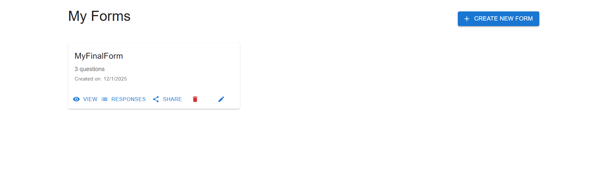

*Dashboard displaying all created forms with options to view, share, edit, and delete.*

### Form Builder - Step 1: Select Base

Choose which Airtable base to connect your form to.

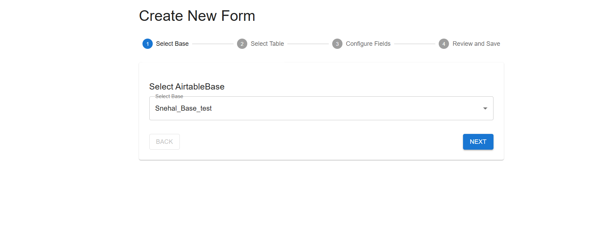

*Multi-step form builder showing the base selection step with progress indicator.*

### Form Builder - Step 2: Select Table

Select the table from your chosen base that will store form responses.

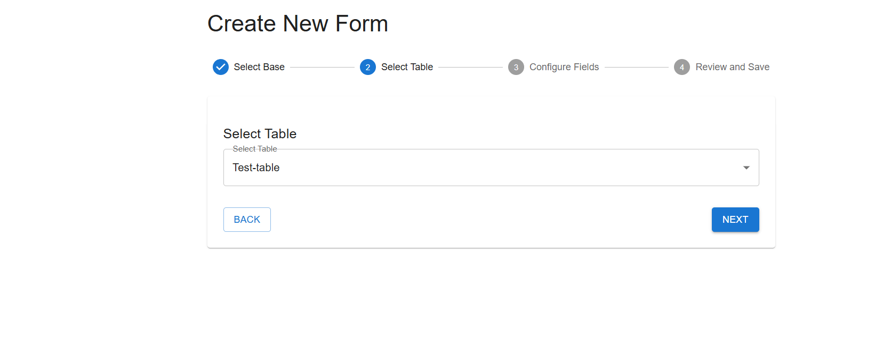

*Form builder showing table selection step with selected table displayed.*

### Form Builder - Step 3: Configure Fields

Choose and configure which fields from your Airtable table should appear in the form, including field types and conditional logic.

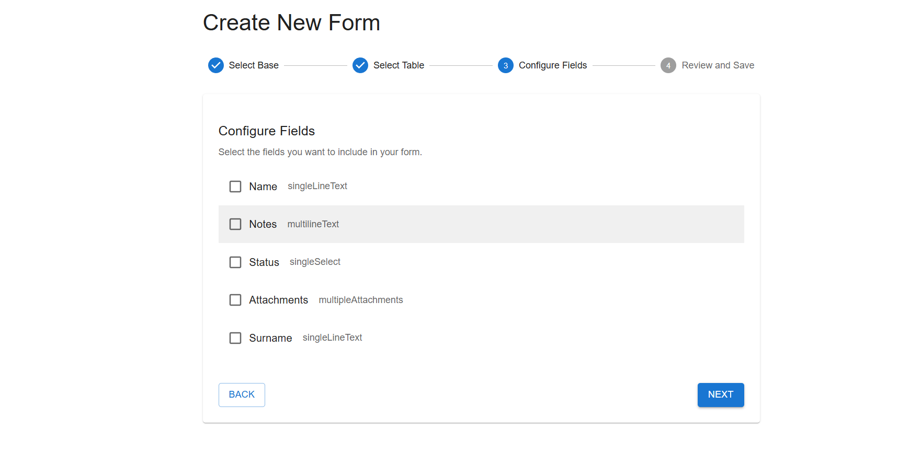

*Field configuration screen showing available fields including Name, Notes, Status, Attachments, and Surname.*

### Form Builder - Step 3.2: Configure Fields (Additional View)

Additional view of field configuration screen.

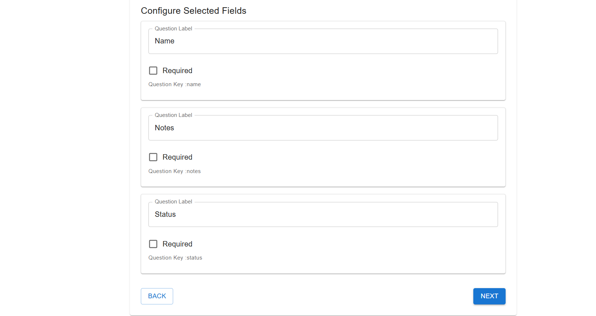

*Alternative view of field configuration with field selection options.*

### Form Builder - Step 4: Review and Save

Review your form configuration before finalizing.

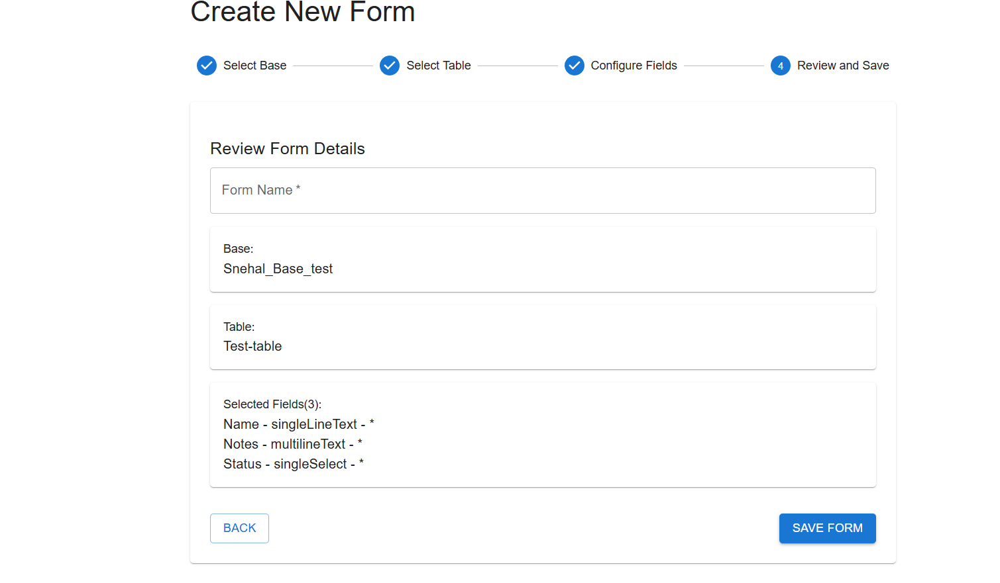

*Final review step showing form name input and summary of selected fields.*

### Public Form View

The public-facing form that users fill out and submit. This is the shareable form link.

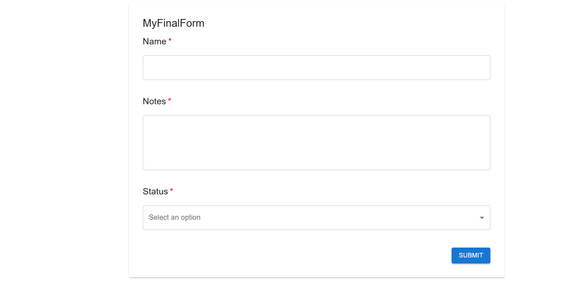

*Public form displaying Name, Notes, and Status fields with submit button.*

### Form Responses Page

View and manage all responses submitted for a specific form.

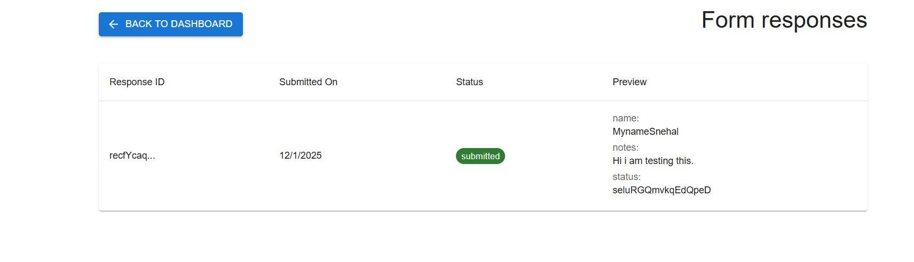

*Form responses table showing response ID, submission date, status, and preview of submitted data.*

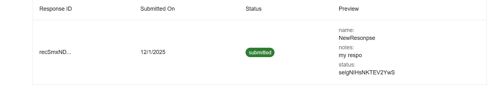

*Alternative view of form responses page showing detailed response information.*

### Airtable Integration Views

View submitted form responses directly in your Airtable base with synced data.

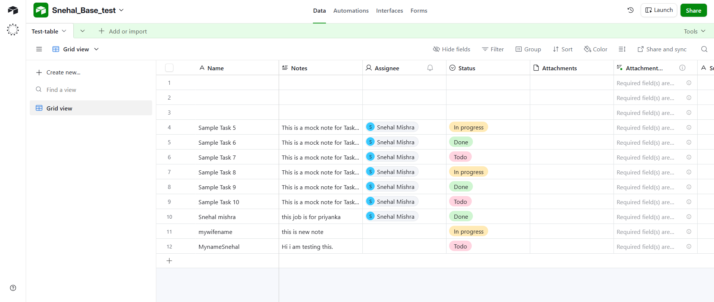

*Airtable base showing records created from form submissions, including Name, Notes, Status, and Attachment fields.*

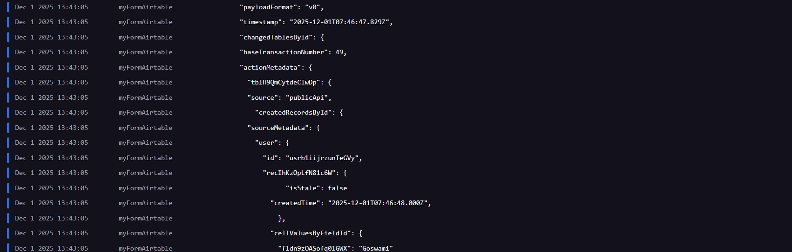

*Additional view of Airtable table with form submissions.*

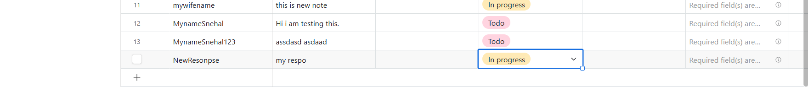

*Detailed view of Airtable table showing multiple records and fields.*

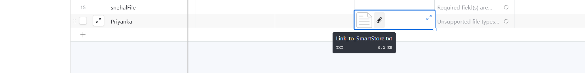

*Airtable table view showing file uploads and attachment fields.*

### Database View

MongoDB database view showing stored form responses and form configurations.

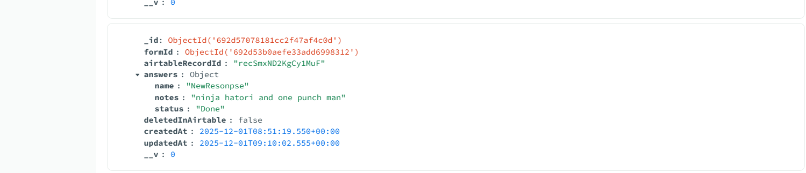

*MongoDB database displaying stored form responses with answers and metadata.*

### OAuth Integration

OAuth integration and consent screens for Airtable authentication.

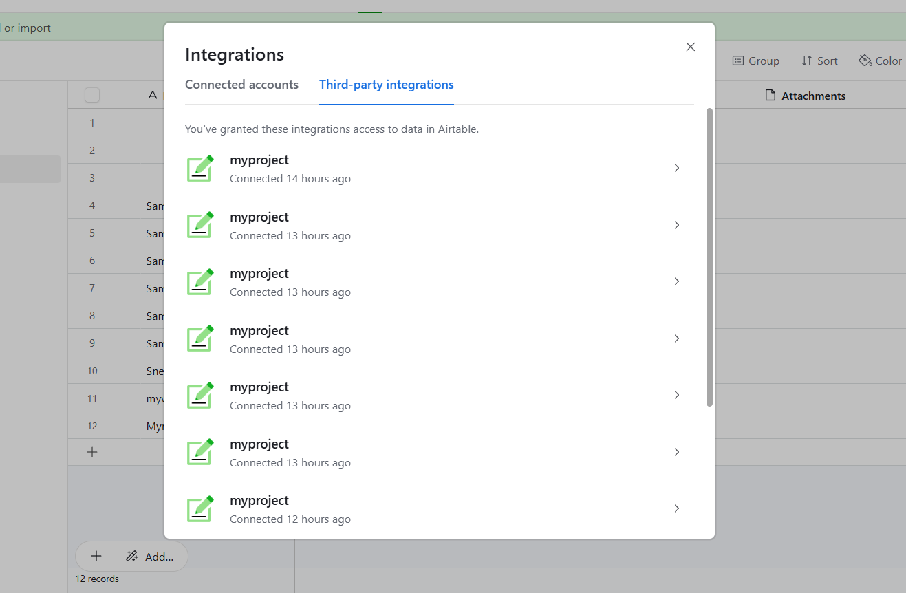

*OAuth integration settings showing connected Airtable integrations.*

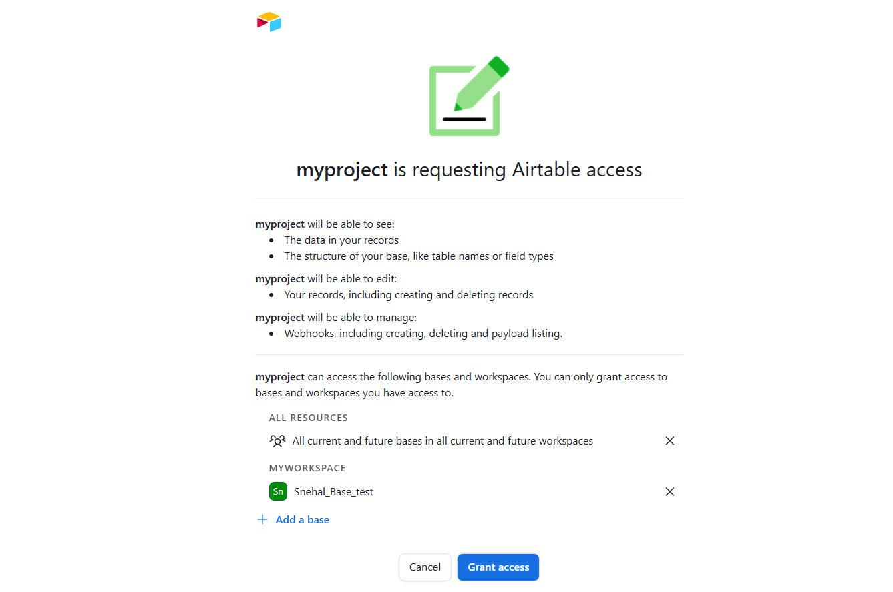

*Airtable OAuth authorization screen showing permissions requested by the application.*

### Additional Output Images

Additional screenshots and output views from the application.

> **Note**: Screenshot files have been renamed to remove spaces for better GitHub markdown compatibility. All images should display correctly when files are committed to the repository.


*Output Image 1 - Application screenshot*

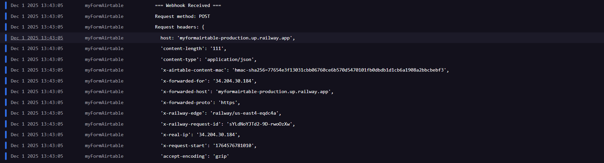

*Output Image 2 - Application screenshot*


*Output Image 3 - Application screenshot*

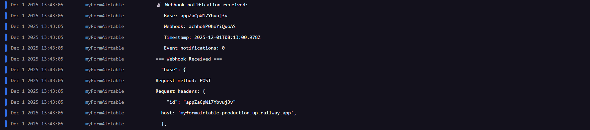

*Output Image 4 - Application screenshot*


*Output Image 5 - Application screenshot*

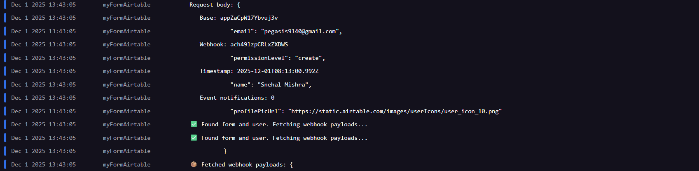

*Output Image 6 - Application screenshot*


*Output Image 7 - Application screenshot*

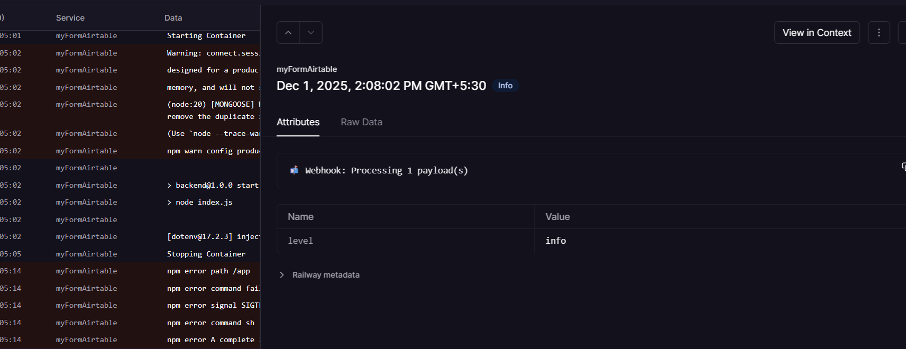

*Output Image 8 - Application screenshot*


*Output Image 9 - Application screenshot*

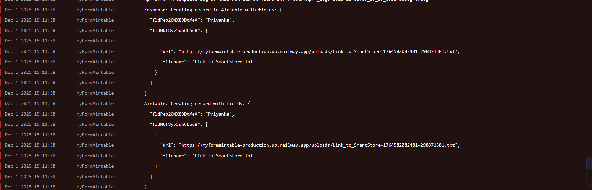

*Output Image 10 - Application screenshot*

### Application Wireframe

```
┌─────────────────────────────────────────────────────────┐
│                    Navigation Bar                        │
│  [Logo]              [Dashboard] [Forms] [Logout]       │
└─────────────────────────────────────────────────────────┘

┌─────────────────────────────────────────────────────────┐
│                    Dashboard Page                        │
│                                                          │
│  My Forms                                    [+ Create] │
│  ┌──────────────────────────────────────────────────┐   │
│  │ Form Name: Contact Form                          │   │
│  │ Questions: 5 | Created: 12/1/2025                │   │
│  │ [View] [Responses] [Share] [Edit] [Delete]      │   │
│  └──────────────────────────────────────────────────┘   │
│                                                          │
└─────────────────────────────────────────────────────────┘

┌─────────────────────────────────────────────────────────┐
│                    Form Builder                          │
│                                                          │
│  Step 1: Select Base          [●────○────○────○]       │
│  ┌──────────────────────────────────────────────────┐   │
│  │ [Dropdown: Select Airtable Base]                 │   │
│  │                                    [BACK] [NEXT] │   │
│  └──────────────────────────────────────────────────┘   │
│                                                          │
│  Step 2: Select Table         [○────●────○────○]       │
│  Step 3: Configure Fields     [○────○────●────○]       │
│  Step 4: Review and Save      [○────○────○────●]       │
└─────────────────────────────────────────────────────────┘

┌─────────────────────────────────────────────────────────┐
│                  Public Form View                        │
│                                                          │
│  Form Name: Contact Form                                 │
│  ┌──────────────────────────────────────────────────┐   │
│  │ Name *                                           │   │
│  │ [Text Input Field]                               │   │
│  │                                                   │   │
│  │ Email *                                          │   │
│  │ [Text Input Field]                               │   │
│  │                                                   │   │
│  │ Message                                          │   │
│  │ [Multi-line Text Area]                           │   │
│  │                                                   │   │
│  │                                           [Submit]│   │
│  └──────────────────────────────────────────────────┘   │
└─────────────────────────────────────────────────────────┘
```

### Demo Video

_Link to demo video showing:_
- Creating a form
- Configuring conditional logic
- Submitting a form
- Viewing responses in Airtable

> **Note**: To add screenshots, create a `docs/screenshots/` folder in your project root and place your screenshot images there with the filenames referenced above.

## 🔍 Troubleshooting

### Common Issues

**1. OAuth Redirect URI Mismatch**
- Ensure redirect URL in Airtable matches `BACKEND_URL/auth/airtable/callback`
- Check for trailing slashes

**2. Webhooks Not Working**
- Verify `BACKEND_URL` uses HTTPS (required by Airtable)
- Check webhook is registered in Airtable
- Verify webhook endpoint is accessible

**3. File Uploads Not Appearing in Airtable**
- Check file URL is publicly accessible
- Verify URL uses HTTPS
- Check Airtable attachment field format: `[{url: "...", filename: "..."}]`

**4. Conditional Logic Not Working**
- Verify rule syntax is correct
- Check question keys match
- Ensure answer values match expected format

**5. MongoDB Connection Issues**
- Verify `MONGODB_URI` is correct
- Check IP whitelist in MongoDB Atlas
- Verify network connectivity

## 📝 License

This project is licensed under the ISC License.

## 👥 Contributing

Contributions are welcome! Please feel free to submit a Pull Request.

## 📧 Support

For issues and questions:
- Open an issue on GitHub
- Contact: [snehal9140@gmail.com]

## 🙏 Acknowledgments

- [Airtable](https://airtable.com/) for their powerful API
- [Material-UI](https://mui.com/) for the UI components
- [Railway](https://railway.app/) and [Vercel](https://vercel.com/) for hosting

---

**Built with ❤️ using React, Node.js, and Airtable**

